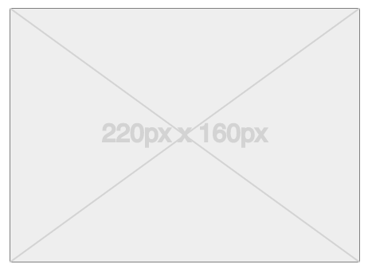

# React Placeholder Image

A simple react component that renders a placeholder image with the specified dimensions.

Useful for `Whiteboxing` a React application.

## Features

- Renders an svg image with background cross
- Renders the image dimensions
- Supports pixel and percentage based dimensions

## Example



## Usage

Install the component

```bash
npm i react-placeholder-img
```

Add placeholders to your components

```javascript
import PlaceHolderImage from 'react-placeholder-img';

export const Home = () => (
  <div>
    <PlaceHolderImage width="220px" height="160px" />
  </div>
);
```
